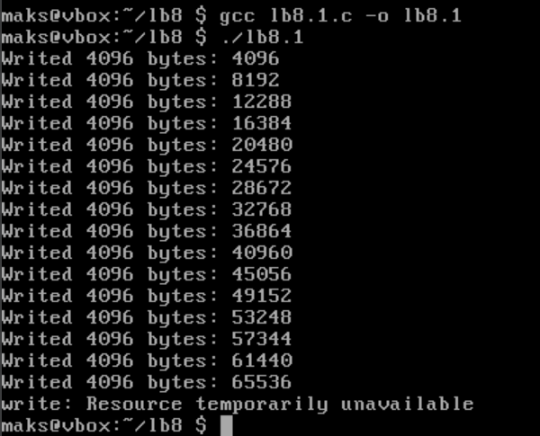
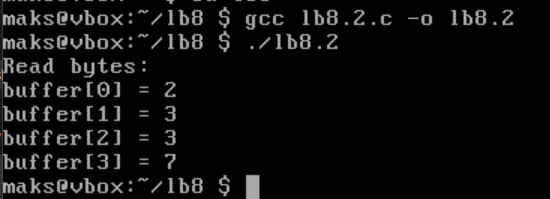
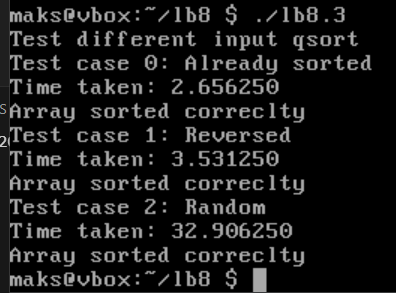
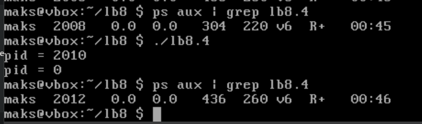
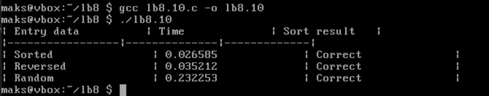

# Практична 8

## 1
В цьому завданні потрібно дізнатися, чи зможе write повернути значення відмінне від nbytes.
Для цього експеременту використаємо ```pipe```:
```c
#include <stdio.h>
#include <unistd.h>
#include <string.h>
#include <fcntl.h>
#include <errno.h>

int main() {
    int pipefd[2];
    if (pipe(pipefd) == -1) {
        perror("pipe");
        return 1;
    }

    fcntl(pipefd[1], F_SETFL, O_NONBLOCK);

    char buffer[4096];
    memset(buffer, 'A', sizeof(buffer));

    ssize_t total_written = 0;
    while (1) {
        ssize_t count = write(pipefd[1], buffer, sizeof(buffer));
        if (count == -1) {
            perror("write");
            break;
        } else if (count < sizeof(buffer)) {
            printf("Written: %zd with %zu bytes\n", count, sizeof(buffer));
            break;
        } else {
            total_written += count;
            printf("Writen %zd bytes: %zd\n", count, total_written);
        }
    }

    close(pipefd[0]);
    close(pipefd[1]);
    return 0;
}
```
Компілюємо і запускаємо:


Як бачимо, ```pipe``` має обмежений розмір буфера, який сягає 64кб. Коли буфер заповнений, а ```pipe``` неблокуючий, ```write()``` не чекає, а одразу повертає ```-1```. Тобто, ```write()``` може записати менше байтів, ніж просили, або взагалі нічого не записати, якщо буфер заповнений і ```pipe``` неблокуючий.


---

## 2

Спочатку створимо .bin файл який переймає таку послідовність байтів: 4, 5, 2, 2, 3, 3, 7, 9, 1, 5.
```c
#include <stdio.h>

int main() {
    unsigned char data[] = { 4, 5, 2, 2, 3, 3, 7, 9, 1, 5 };
    FILE *f = fopen("test.bin", "wb");
    if (!f) {
        perror("fopen");
        return 1;
    }
    fwrite(data, sizeof(data), 1, f);
    fclose(f);
    return 0;
}
```
Ця програма створила файл [test.bin](test.bin).

Функція ```lseek(fd, 3, SEEK_SET);``` встановлює покажчик на байт з індексом ```[3]``` та значенням всередені нього ```2```.
Потім є функція ```read(fd, &buffer, 4);``` яка читає чотири байти поспіль. Тобто фактично в нашому масиві мають вивестися ```[2],[3],[3],[7]```.

Напишемо [програму](lb8.2.c) яка відкриває [test.bin](test.bin) для читання, переміщає показник на третій байт та читає після нього наступних чотири байта:
```c
#include <stdio.h>
#include <fcntl.h>
#include <unistd.h>

int main(){
	int fd = open("test.bin", O_RDONLY);
	if (fd == -1){
		perror("open");
		return 1;
	}
	
	unsigned char buffer[4];

	if (lseek(fd,3,SEEK_SET) == -1){
		perror("lseek");
		close(fd);
		return 1;
	}

	ssize_t bytes_read = read(fd, buffer, 4);
	if (bytes_read == -1){
		perror("read");
		close(fd);
		return 1;
	}

	printf("Read bytes:\n");
	for (int i = 0; i < bytes_read; i++){
		printf("buffer[%d] = %d\n", i, buffer[i]);
	}

	close(fd);
	return 0;
}
```

Скомпілюємо й запустимо:



Буфер містить те, про що й було сказано.

---

## 3

Тут потрібно було протестувати функція ```qsort()```, яка розшифровується як "quick sort" і використовує рекурсивний алгоритм для сортування.

Для наглядного теста використаємо 3 різні випадки:
1. Коли масив зазделегіть відсортований;
2. Масив відсортований але в зворотньому порядку;
3. Масив з випадковими числами;

За розмір масива візьмемо 100 мільйонів елементів, скомпілюємо і запустимо [програму:](lb8.2.c)



На сортування масиву з випадковими числами у мене пішло найбільше часу, майже 33 секунди.

---

## 4

Потрібно було дописати програму використовуючи ```fork()```.  Ця функція створює точну копію поточного процесу - дочірній процес. Також, для дочірнього процесу він повертає ```0``` в той час для батьківського процесу значення буде ```pid``` дочірнього процесу. Для помилки аналогічно значення буде ```-1```.

Дописуємо [програму](lb8.4.c) й запускаємо:



Ось тут я спочатку я прописав ```ps aux | grep lb8.4``` для того, щоб було видно ```pid``` програми, запустив її та знову переглянув ```pid``` через команду. Спочатку вивівся дочірній процес, а потім батьківський. Функцію ```fork()``` реалізовано правильно.

---

## 10

Тут ми маємо зробити майже все те саме, що й робили в [третьому розділі](#3). 

В [оновленій програмі](lb8.10.c) я додав створення таблиці та більш точний час виводу.

Для того, щоб це займало меньше часу зробив ```SIZE``` не таким великим. Скомпілюємо й запустимо:



Не найкращий вигляд таблиці, але все працює правильно. В [обговореннях в інтернеті](https://stackoverflow.com/questions/2415193/worst-case-for-quicksort-when-can-it-occur) я прочитав, що:
```bash
If the first element is always chosen as the pivot, then an already sorted list is the worst-case. Often there's a high probability that the array is already/nearly sorted, so this implementation is rather poor.

Analogously, selecting the last element as the pivot is bad for the same reason.
```
І це достатньо цікаво, адже повертаючись до мого виводу можна сказати зовсім інше. В тому ж обговорені також йшла мова за деякий ```median-of-three```:
```bash
So some corners are cut, and people devised the median-of-3 algorithm. Of course, later even this was exploitable by the so-called median-of-3 "killer".
```

Скоріше всього саме через це в мене найшвидшим було те, що малося б бути найповільнішим.